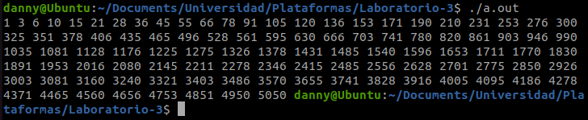
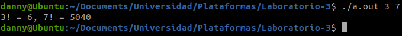

### Universidad de Costa Rica
#### IE0117 Programación Bajo Plataformas Abiertas
#### B93070 Daniela Fonseca Zumbado
---
# Laboratorio 3

## Introducción

## Implementación

### Ejercicio 1
El objetivo de este código es calcular los primeros 100 números triangulares. Los números triangulares se cumplen con la siguiente expresión [[1]](https://github.com/dfonsecz/Laboratorio-3?tab=readme-ov-file#referencias).

$$
t_n = \frac{n(n+1)}{2}
$$

Se implementó una función que recibe un parámetro entero $n$, y obtiene el $n-énesimo$ número triangular a partir de la expresión anterior.

Posteriormente, en la función principal se imprimen los primeros 100 números triangulares.

### Ejercicio 2
Para este ejercicio el objetivo es modificar un código proporcionado para que cumpla la funcionalidad correcta, la cuál es calcular el factorial de dos números proporcionados. La función factorial de un número se representa como $n!$, y corresponde a la multiplicación de todos los números enteros hasta el número $n$.

$$
n! = 1 \cdot 2 \cdot 3 \cdot ... \cdot n
$$

Con respecto al error en el código, lo que se modificó fue la declaración de una variable en la función factorial, cuyo tipo ya estaba declarado anteriormente.

```
int factorial (int n) {
    int i = 1;
    while (n > 1) {
        i = i * n;
        n = n - 1; // Corregido - se quito la declaracion de la variable, era redundante
    }
    return i;
}
```

Para permitir que el usuario ingrese los números para los cuales quiere calcular el factorial, se utilizó la función `atoi()`, la cual permite convertir una serie de caracteres en enteros [[2]](https://github.com/dfonsecz/Laboratorio-3?tab=readme-ov-file#referencias). Con esta se leen los argumentos ingresados por el usuario.

```
// Convertir character string a int
    int n1 = atoi(argv[1]);
    int n2 = atoi(argv[2]);
```

### Ejercicio 3
Para este último ejercicio se proporciona un código base que define una matriz cuadrada $n \times n$, donde $n = 5$. Sin embargo, se solicita que el usuario sea capaz de ingresar el tamaño de la matriz que desea. En el código, se implementó que este valor pueda ser ingresado en la línea de comandos. De lo contrario, se utiliza un número aleatorio.

En primer lugar, se añadió una función para generar la matriz aleatoria, de un tamaño $n \times n$. El tamaño de esta función está definido por el argumento que ingresa el usuario, que es recibido en la función principal, y utilizado como variable al llamar a la función que genera la matriz. Para efectos de que la matriz generada no sea excesivamente grande, se puso un límite para que $n$ no sobrepase 10.

En la implementación de la función `findLargestSquare`, se aplicó un for loop que itera sobre la matriz y evalúa si los números adyacentes corresponden a 1's. Si esto sucede, incrementa el contador del 'tamaño de la matriz de 1's actual'. De ser el caso de que la variable `largestSquareSize` sea menor que ese contador, se actualiza el valor de esta para que continúe siendo el mayor.

Así mismo, se añadió una función que imprima toda la matriz.

## Resultados
### Ejercicio 1
Como se puede observar a continuación, al ejecutar la función, se calculan e imprimen los primeros 100 números triangulares.



### Ejercicio 2
Al ejecutar el archivo generado por `ejercicio2.c`, colocando dos números enteros como argumento, se calculan e imprimen los factoriales de estos números.



### Ejercicio 3
Si se ejecuta el archivo generado por `ejercicio3.c` con un argumento (i.e. `./a.out 7`), se obtiene una matriz $7 \times 7$, como la que se observa en la imagen. Se obtiene además el tamaño de la matriz $m \times m$ de 1's más grande generada, la cual en este caso es de $2 \times 2$.


Al ejecutar el archivo generado por `ejercicio3.c`, sin especificar un argumento, se genera una matriz de tamaño aleatorio. El programa también obtiene el tamaño de la matriz $m \times m$ más grande de 1's, que en este caso también es de $2 \times 2$.


## Conclusiones y recomendaciones
1. Se recomienda prestar compilar el código continuamente conforme se va realizando cambios por dos motivos: a) para identificar de forma temprana los errores, b) para identificar cuáles son estos errores, ya que al compilar, la ventana de la terminal indica cierto mensaje que puede ser útil para entender el error.
2. Así mismo, se recomienda trabajar cada modificación al output final (el entregable) por separado y unirlo al final. Si se hacen demasiadas actualzaciones durante el proceso puede resultar de manera desordenada.

## Referencias
[1] E. Dionisio Pérez, “Juegos Matemáticos Números Triangulares Cuadrados,” Pensamiento Matemático, vol. IV, no. 1, Apr. 1, 2014 
[2] IBM, “atoi ()- convertir Serie de caracteres en entero,” IBM, https://www.ibm.com/docs/es/i/7.5?topic=functions-atoi-convert-character-string-integer. 
