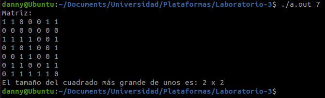
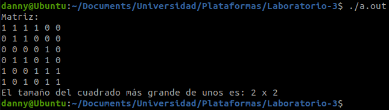

### Universidad de Costa Rica
#### IE0117 Programación Bajo Plataformas Abiertas
#### B93070 Daniela Fonseca Zumbado
---
# Laboratorio 3

## Introducción

## Implementación

### Ejercicio 1
El objetivo de este código es calcular los primeros 100 números triangulares. Los números triangulares se cumplen con la siguiente expresión [[1]](https://github.com/dfonsecz/Laboratorio-3?tab=readme-ov-file#referencias).

$$
t_n = \frac{n(n+1)}{2}
$$

### Ejercicio 2
Para este ejercicio el objetivo es modificar un código proporcionado para que cumpla la funcionalidad correcta, la cuál es calcular el factorial de dos números proporcionados. La función factorial de un número se representa como $n!$, y corresponde a la multiplicación de todos los números enteros hasta el número $n$.

$$
n! = 1 \cdot 2 \cdot 3 \cdot ... \cdot n
$$

### Ejercicio 3
Para este último ejercicio se proporciona un código base que define una matriz cuadrada $n \times n$, donde $n = 5$. Sin embargo, se solicita que el usuario sea capaz de ingresar el tamaño de la matriz que desea. En el código, se implementó que este valor pueda ser ingresado en la línea de comandos. De lo contrario, se utiliza un número aleatorio.

## Resultados
### Ejercicio 1
### Ejercicio 2
### Ejercicio 3
Si se ejecuta el archivo 'ejercicio3.c 7', se obtiene una matriz $7 \times 7$, como la que se observa en la imagen. Se obtiene además el tamaño de la matriz $m \times m$ de 1's más grande generada.

Al ejecutar el archivo 'ejercicio3.c', sin especificar un argumento, se genera una matriz de tamaño aleatorio. El programa también obtiene el tamaño de la matriz $m \times m$ más grande de 1's.

## Conclusiones y recomendaciones
## Referencias
[1] E. Dionisio Pérez, “Juegos Matemáticos Números Triangulares Cuadrados,” Pensamiento Matemático, vol. IV, no. 1, Apr. 1, 2014 
